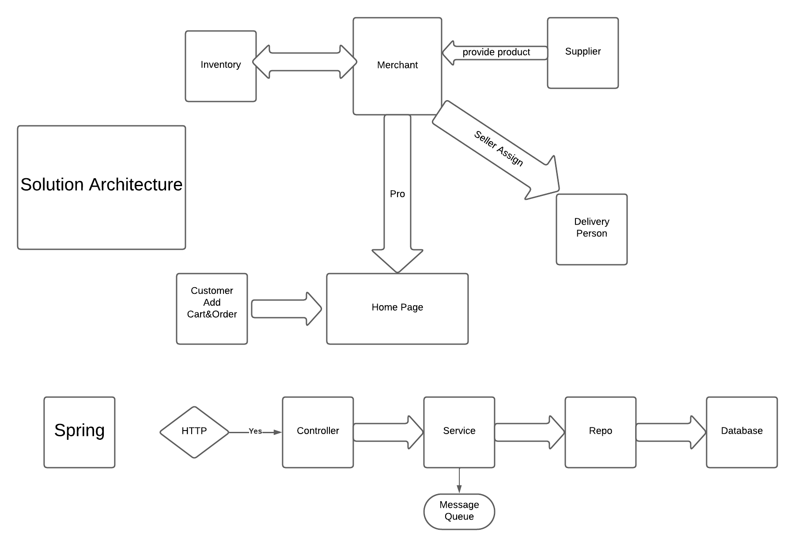

# Inventory Management System

This project is an Inventory Management System designed to handle products and orders within an e-commerce platform. The design is based on the architecture depicted in the diagram below.



## Overview

### Solution Architecture

The solution consists of several components interacting with each other to manage the inventory, orders, and delivery processes. The main components are:

- **Merchant**: Manages product provision from suppliers and handles inventory.
- **Supplier**: Provides products to merchants.
- **Delivery Person**: Handles the delivery of products to customers.
- **Customer**: Adds items to the cart and places orders.
- **Home Page**: The interface where customers interact with the system.

### Spring Framework

The backend is developed using the Spring framework, which handles HTTP requests through controllers, processes business logic in services, interacts with repositories for data persistence, and communicates with a database.

## Data Storage

### Product Data

- **Database**: MongoDB
- **Fields**:
  - `merchant name`
  - `price`
  - `description`

### Order Data

- **Database**: JPA (Java Persistence API)
- **Fields**:
  - `orderList` (contains one item)
- **Item Fields**:
  - `quantity`
  - `price`

### Storage Data

- **Database**: JPA (Java Persistence API)
- **Fields**:
  - `skuCode` (the name of the product)
  - `quantity`

# Interservice Communication

To ensure seamless integration between the Order and Storage microservices, the system performs a synchronous HTTP call to the Storage service when placing an order. This call checks if there is enough inventory to support the order and validates the order.

## Order Placement Flow

1. **Customer places an order**: The customer adds items to the cart and submits the order.
2. **Order service validation**: The Order service validates the order details by generating an order number and mapping the order request items to real order items.
3. **Inventory check**:
   - The Order service extracts the SKU codes from the order items.
   - It then makes a synchronous HTTP request to the Storage service to check the inventory levels for the requested SKU codes.
4. **Order processing**:
   - If the inventory is sufficient (i.e., all items are in stock), the order is processed and saved to the database.
   - If the inventory is insufficient (i.e., one or more items are out of stock), the order is rejected with an appropriate message.


### Example of Interservice Communication

#### Order Service

```java
@Service
public class OrderService {
    
    @Autowired
    private RestTemplate restTemplate;

    @Autowired
    private OrderRepository orderRepository;

    public String placeOrder(OrderRequest orderRequest) {
        // Check inventory
        Boolean isInventoryAvailable = restTemplate.postForObject(
                "http://storage-service/api/v1/check-inventory", 
                orderRequest.getOrderLists_Copy(), 
                Boolean.class);
        
        if (Boolean.TRUE.equals(isInventoryAvailable)) {
            // Save the order
            orderRepository.save(orderRequest.toOrder());
            return "Order Placed Successfully";
        } else {
            return "Order Failed: Insufficient Inventory";
        }
    }
}
