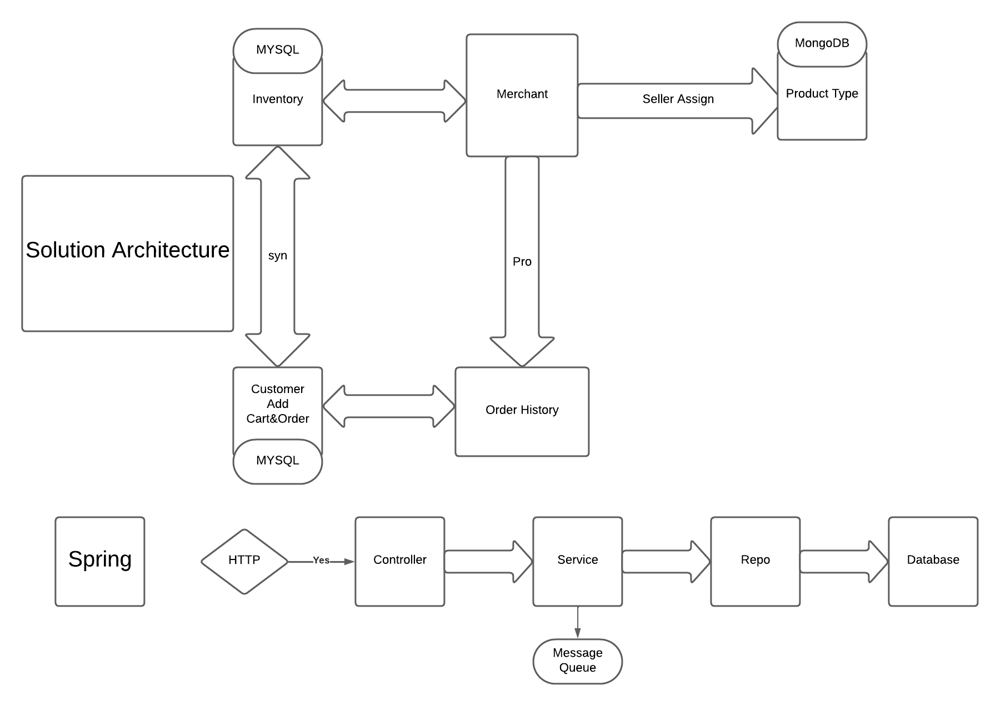

# Inventory Management System

This project is an Inventory Management System designed to handle products and orders within an e-commerce platform. The design is based on the architecture depicted in the diagram below.



## Overview

### Solution Architecture

The solution consists of several components interacting with each other to manage the inventory, orders, and delivery processes. The main components are:

- **Merchant**: Manages product provision from suppliers and handles inventory.
- **Supplier**: Provides products to merchants.
- **Delivery Person**: Handles the delivery of products to customers.
- **Customer**: Adds items to the cart and places orders.
- **Home Page**: The interface where customers interact with the system.

### Spring Framework

The backend is developed using the Spring framework, which handles HTTP requests through controllers, processes business logic in services, interacts with repositories for data persistence, and communicates with a database.

## Data Storage

### Product Data

- **Database**: MongoDB
- **Fields**:
  - `merchant name`
  - `price`
  - `description`

### Order Data

- **Database**: JPA (Java Persistence API)
- **Fields**:
  - `orderList` (contains one item)
- **Item Fields**:
  - `quantity`
  - `price`

## Tests

The project includes tests to ensure the functionality of the system. Below is an example test for creating a product.

### Test Implementation
#### Product Post Test example
The test class uses MockMvc to simulate HTTP requests, a Testcontainers MongoDB instance for an isolated database environment, and JUnit for test assertions.
```java
// Sends a POST request to create a new product and expects a 201 Created status
mockMvc.perform(MockMvcRequestBuilders.post("/api/v2/product")
                .contentType(MediaType.APPLICATION_JSON)
                .content(jsonPostRequestString))
        .andExpect(status().isCreated());
// Verifies that the number of products in the repository is 1
Assertions.assertEquals(1, productRepository.findAll().size());
```
